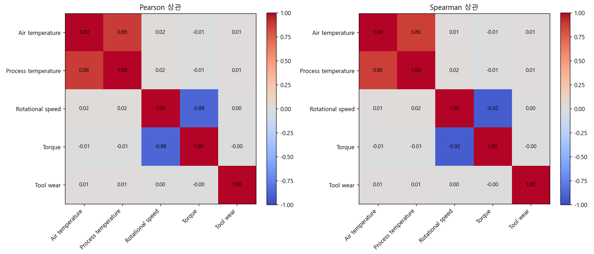
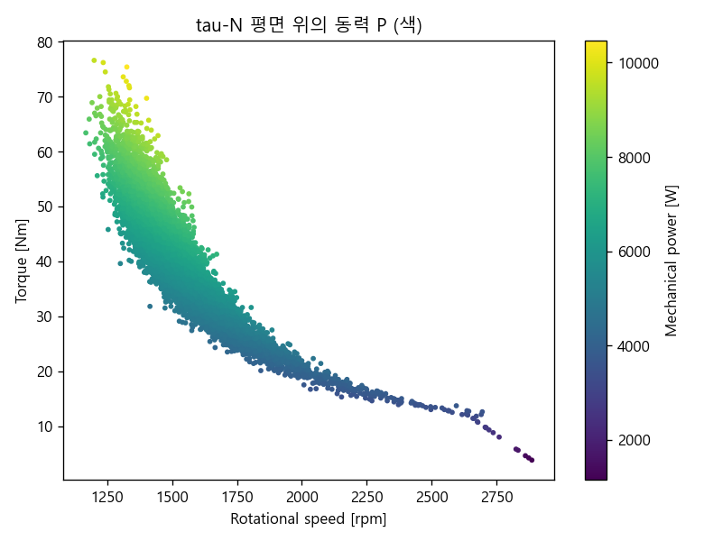
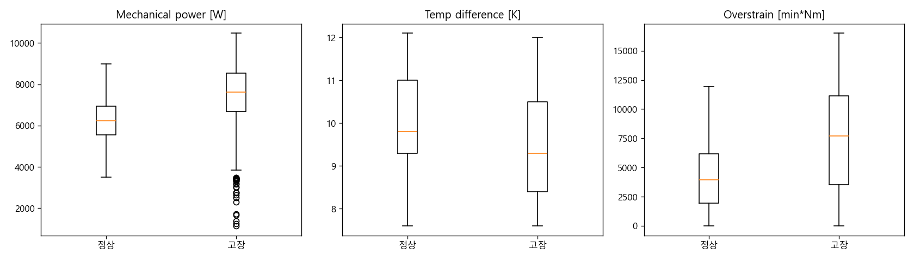

# AI4I 2020 예지보전 데이터 분석

산업 설비 센서 데이터로 기계 고장을 분석한 개인 포트폴리오 프로젝트입니다.
기계공학 전공을 살려서, 모델 정확도를 올리는 것보다 **"고장이 왜, 어떤 조건에서 일어나는가"** 를 물리적으로 설명하는 데 초점을 맞췄습니다.

현재 **Phase 1 (EDA)** 와 **Phase 2 (물리 기반 피처 엔지니어링)** 까지 완료했고, Phase 3(가설검정으로 고장 조건 규명)와 Phase 4(예측 모델)는 진행 중입니다.

## 프로젝트 목적

예지보전(Predictive Maintenance) 예제를 찾아보면 대부분 센서값을 그대로 모델에 넣고 "정확도 99%"로 끝나는 경우가 많았습니다. 그런데 정작 현장에서 알고 싶은 건 "이 설비가 왜 고장 나는가"라고 생각했습니다.

센서값을 그대로 쓰기보다 의미 있는 물리량(동력, 온도구배, 누적 부하)으로 바꾸면 고장을 해석할 수 있을 거라고 봤습니다. 그래서 이 프로젝트의 목표는 높은 점수가 아니라 **설명 가능한 분석**입니다.

## 데이터셋

[AI4I 2020 Predictive Maintenance Dataset](https://archive.ics.uci.edu/dataset/601/ai4i+2020+predictive+maintenance+dataset) (UCI)

- 10,000행, 결측 없음
- 입력: 제품등급(L/M/H), 공기온도, 공정온도, 회전속도, 토크, 공구마모
- 타깃: 기계고장(이진) + 5개 고장유형 (TWF/HDF/PWF/OSF/RNF)

이 데이터는 실제 설비가 아니라 합성 데이터라, 고장이 만들어진 규칙이 논문(Matzka, 2020)에 공개돼 있습니다. 그래서 나중에(Phase 3) 데이터에서 직접 찾아낸 결과를 이 "정답"과 대조해볼 수 있다는 게 오히려 장점입니다.

## 노트북 구성


| 노트북                       | 내용                      | 상태   |
| ------------------------------ | --------------------------- | -------- |
| `01_eda.ipynb`               | 탐색적 데이터 분석        | 완료   |
| `02_physics_features.ipynb`  | 물리 기반 피처 엔지니어링 | 완료   |
| `03_insight_discovery.ipynb` | 고장 조건 규명 (가설검정) | 진행중 |
| `04_modeling.ipynb`          | 예측 모델                 | 예정   |

## Phase 1 - 탐색적 데이터 분석

EDA에서 확인한 것들 중 기록해둘 만한 것들입니다.

**고장은 드물다.** 전체의 3.39%만 고장입니다. 이렇게 불균형이 심하면 정확도(accuracy)는 거의 의미가 없습니다. 전부 "정상"이라고 찍어도 96.6%가 나오니까요. 그래서 이후 평가는 recall, F1 위주로 봐야 합니다.

**데이터 누수부터 걸러냈다.** UDI와 Product ID는 그냥 식별자라 빼야 하고, TWF/HDF/PWF/OSF/RNF 다섯 컬럼은 사실 타깃(기계고장)을 이루는 구성요소입니다. 이걸 입력으로 넣으면 정답을 미리 알려주는 셈이라 제외했습니다.

**회전속도와 토크는 강한 음의 상관(-0.88)을 보였다.** 처음엔 그냥 상관관계인가 했는데, 회전기계의 동력이 P = 토크 x 각속도라는 걸 떠올리면 자연스러운 반비례입니다. 이게 나중에 "동력"이라는 피처를 만든 근거가 됐습니다.



**이상치를 무조건 지우지 않았다.** 회전속도에 IQR 기준 이상치가 400개 넘게 나왔는데, 확인해보니 전부 토크가 낮은 구간이었습니다. 위 반비례 관계상 토크가 낮으면 회전속도가 튀는 게 정상이라, 측정 오류가 아니라 정상 운전값으로 보고 남겨뒀습니다. 통계적 이상치와 물리적 이상은 다르다는 걸 확인한 부분입니다.

**등급 차이는 운전조건이 아니라 내성 차이로 보인다.** 등급별(L/M/H) 고장률은 달랐지만(L이 제일 높음), 토크와 회전속도 분포는 등급 간 거의 같았습니다. 즉 등급이 낮은 제품이 더 험하게 돌아가는 게 아니라, 같은 부하를 덜 버티는 것으로 해석됩니다.

**정규성 검정.** 표본이 커서(n=10,000) Shapiro-Wilk 대신 D'Agostino 검정을 썼고, 토크만 정규분포였습니다. 나머지는 비정규라 이후 검정은 비모수(Mann-Whitney)를 기본으로 잡기로 했습니다.

## Phase 2 - 물리 기반 피처 엔지니어링

EDA에서 얻은 근거로 센서값을 물리량으로 바꿨습니다.


| 파생 피처    | 계산                | 겨냥한 고장       |
| -------------- | --------------------- | ------------------- |
| 각속도 omega | 2*pi*N/60           | (동력 계산용)     |
| 동력 P       | 토크 x omega        | 동력 이상 (PWF)   |
| 온도차 dT    | 공정온도 - 공기온도 | 방열 실패 (HDF)   |
| 누적응력     | 공구마모 x 토크     | 과부하 파손 (OSF) |

동력 P는 두 센서(토크, 회전속도)를 하나의 "부하" 축으로 묶어줍니다. 아래 그림에서 보듯 토크-회전속도 평면 위에서 동력이 반비례 곡선을 따라 등고선처럼 변합니다.



**피처 검증은 조금 신경 썼습니다.** 처음엔 "동력은 몇 kW 범위면 정상" 하는 식으로 데이터에서 범위를 잡아 검증하려 했는데, 생각해보니 검증할 데이터로 기준을 만들면 그 데이터는 항상 통과할 수밖에 없더군요(순환). 그래서 데이터와 무관한 두 가지로만 검증했습니다.

- **부호 불변식**: 온도차 > 0 (공정이 항상 주변보다 뜨겁다), 동력 > 0, 각속도 > 0. 데이터가 위반할 수도 있으니 진짜 검증입니다.
- **손계산 단위 테스트**: 예를 들어 `angular_velocity(60 rpm)`은 `2*pi`여야 한다처럼, 아는 입력의 정답을 코드가 맞히는지 확인합니다 (`test/test_physics.py`).

파생 피처를 정상/고장으로 나눠보니 원래 센서보다 고장을 훨씬 뚜렷하게 갈랐습니다. 특히 동력은 양쪽 극단(너무 낮거나 높거나)에서 고장이 몰렸고, 누적응력과 온도차는 한 방향으로 쏠렸습니다.



"어떤 물리량이 어느 방향으로 고장과 연결되는가"는 다음 단계(Phase 3)에서 통계 검정으로 규명할 예정입니다.

## 프로젝트 구조

```
ai4i_pdm/
├── notebooks/           # 분석 노트북
├── src/
|   ├── config.py        # 경로 설정
|   └─── physics.py       # 물리량 계산 함수 + 검증
├── test/
|   └─── test_physics.py  # 해석적 단위 테스트
├── results/figures/     # 생성된 그림
└── data/raw/            # 원본 데이터 (직접 다운로드)
```

## 실행

```bash
# 1. 패키지 설치
pip install pandas numpy scipy scikit-learn matplotlib

# 2. UCI에서 데이터 다운로드 후 data/raw/ai4i2020.csv 로 저장

# 3. Jupyter로 notebooks/ 의 노트북을 순서대로 실행
```

개발 환경: Python 3.12

## 다음 단계

- **Phase 3**: 각 고장유형이 어떤 물리 조건에서 발생하는지 가설검정(Mann-Whitney + 효과크기)으로 규명하고, 데이터로 찾은 임계값을 공개 규칙과 대조
- **Phase 4**: 물리 피처가 실제로 예측 성능을 올리는지 학습/검증셋으로 확인하고, 해석

## 참고

- S. Matzka, "Explainable Artificial Intelligence for Predictive Maintenance Applications", 2020
- UCI Machine Learning Repository: AI4I 2020 Predictive Maintenance Dataset

---

> 이 프로젝트는 설계/구현/문서화 과정에서 Claude Code를 사용하여 진행되었습니다.