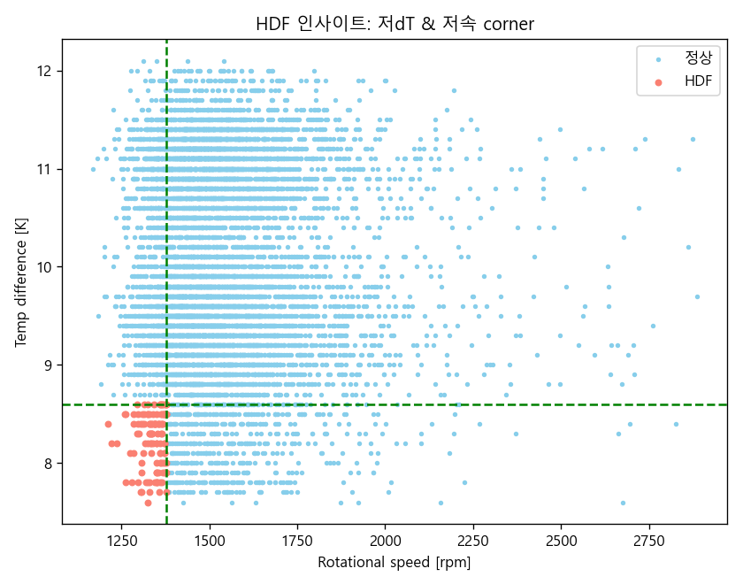
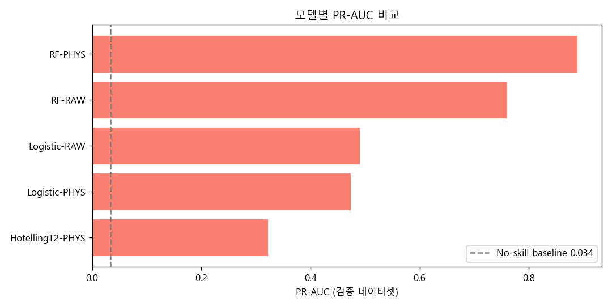

# AI4I 2020 예지보전 데이터 분석

산업 설비 센서 데이터로 기계 고장을 분석한 개인 프로젝트입니다.
기계공학 전공 지식을 토대로, 모델 정확도를 올리는 것보다 **"고장이 왜, 어떤 조건에서 일어나는가"** 를 물리적으로 설명하는 데 초점을 맞췄습니다.

현재 **Phase 1 (EDA)** 부터 **Phase 4 (예측 모델)** 까지 완료했고, Phase 5(해석과 검증, 정비 제언)를 진행할 예정입니다.

## 프로젝트 목적

예지보전(Predictive Maintenance) 예제를 찾아보면 대부분 센서값을 그대로 모델에 넣고 "정확도 99%"로 끝나는 경우가 많았습니다. 그런데 정작 현장에서 알고 싶은 건 "이 설비가 왜 고장 나는가"라고 생각했습니다.

센서값을 그대로 쓰기보다 의미 있는 물리량(동력, 온도구배, 누적 부하)으로 바꾸면 고장을 해석할 수 있을 거라고 봤습니다. 그래서 이 프로젝트의 목표는 높은 성능이 아니라 **설명 가능한 분석**입니다.

## 데이터셋

[AI4I 2020 Predictive Maintenance Dataset](https://archive.ics.uci.edu/dataset/601/ai4i+2020+predictive+maintenance+dataset) (UCI)

- 10,000행, 결측 없음
- 입력: 제품등급(L/M/H), 공기온도, 공정온도, 회전속도, 토크, 공구마모
- 타깃: 기계고장(이진) + 5개 고장유형 (TWF/HDF/PWF/OSF/RNF)

이 데이터는 실제 설비가 아니라 합성 데이터라, 고장이 만들어진 규칙이 논문(Matzka, 2020)에 공개돼 있습니다. 그래서 분석 후(Phase 3) 데이터에서 직접 찾아낸 결과를 이 규칙과 대조해볼 수 있는 특징을 가지고 있습니다.

## 노트북 구성


| 노트북                       | 내용                      | 상태 |
| ------------------------------ | --------------------------- | ---- |
| `01_eda.ipynb`               | 탐색적 데이터 분석        | 완료 |
| `02_physics_features.ipynb`  | 물리 기반 피처 엔지니어링 | 완료 |
| `03_insight_discovery.ipynb` | 고장 조건 규명 (가설검정) | 완료 |
| `04_modeling.ipynb`          | 예측 모델 (3종 비교)      | 완료 |
| `05_interpretation.ipynb`    | 해석과 검증, 정비 제언    | 예정 |

## Phase 1 - 탐색적 데이터 분석

EDA에서 확인한 것들 중 기록해둘 만한 것들입니다.

**고장은 드물다.** 전체의 3.39%만 고장입니다. 이렇게 불균형이 심하면 정확도(accuracy)는 거의 의미가 없습니다. 전부 "정상"이라고 찍어도 96.6%가 나오니까요. 그래서 이후 평가는 recall, F1 위주로 봐야 합니다.

**데이터 누수부터 걸러냈다.** UDI와 Product ID는 그냥 식별자라 빼야 하고, TWF/HDF/PWF/OSF/RNF 다섯 컬럼은 사실 타깃(기계고장)을 이루는 구성요소입니다. 이걸 입력으로 넣으면 정답을 미리 알려주는 셈이라 제외했습니다.

**회전속도와 토크는 강한 음의 상관(-0.88)을 보였다.** 처음엔 그냥 상관관계인가 했는데, 회전기계의 동력이 P = 토크 x 각속도라는 걸 떠올리면 자연스러운 반비례입니다. 이게 나중에 "동력"이라는 피처를 만든 근거가 됐습니다.


**이상치를 무조건 지우지 않았다.** 회전속도에 IQR 기준 이상치가 400개 넘게 나왔는데, 확인해보니 전부 토크가 낮은 구간이었습니다. 위 반비례 관계상 토크가 낮으면 회전속도가 튀는 게 정상이라, 측정 오류가 아니라 정상 운전값으로 보고 남겨뒀습니다. 통계적 이상치와 물리적 이상은 다르다는 걸 확인한 부분입니다.

**등급 차이는 운전조건이 아니라 내성 차이로 보인다.** 등급별(L/M/H) 고장률은 달랐지만(L이 제일 높음), 토크와 회전속도 분포는 등급 간 거의 같았습니다. 즉 등급이 낮은 제품이 더 험하게 돌아가는 게 아니라, 같은 부하를 덜 버티는 것으로 해석됩니다.

**정규성 검정.** 표본이 커서(n=10,000) Shapiro-Wilk 대신 D'Agostino 검정을 썼고, 토크만 정규분포였습니다. 나머지는 비정규라 이후 검정은 비모수(Mann-Whitney)를 기본으로 잡기로 했습니다.

## Phase 2 - 물리 기반 피처 엔지니어링

EDA에서 얻은 근거로 센서값을 물리량으로 바꿨습니다.


| 파생 피처    | 계산                | 겨냥한 고장       |
| -------------- | --------------------- | ------------------- |
| 각속도 omega | 2*pi*N/60           | (동력 계산용)     |
| 동력 P       | 토크 x omega        | 동력 이상 (PWF)   |
| 온도차 dT    | 공정온도 - 공기온도 | 방열 실패 (HDF)   |
| 누적응력     | 공구마모 x 토크     | 과부하 파손 (OSF) |

동력 P는 두 센서(토크, 회전속도)를 하나의 "부하" 축으로 묶어줍니다. 아래 그림에서 보듯 토크-회전속도 평면 위에서 동력이 반비례 곡선을 따라 등고선처럼 변합니다.


**피처 검증은 조금 신경 썼습니다.** 처음엔 "동력은 몇 kW 범위면 정상" 하는 식으로 데이터에서 범위를 잡아 검증하려 했는데, 생각해보니 검증할 데이터로 기준을 만들면 그 데이터는 항상 통과할 수밖에 없더군요(순환). 그래서 데이터와 무관한 두 가지로만 검증했습니다.

- **부호 불변식**: 온도차 > 0 (공정이 항상 주변보다 뜨겁다), 동력 > 0, 각속도 > 0. 데이터가 위반할 수도 있으니 진짜 검증입니다.
- **손계산 단위 테스트**: 예를 들어 `angular_velocity(60 rpm)`은 `2*pi`여야 한다처럼, 아는 입력의 정답을 코드가 맞히는지 확인합니다 (`test/test_physics.py`).

파생 피처를 정상/고장으로 나눠보니 원래 센서보다 고장을 훨씬 뚜렷하게 갈랐습니다. 특히 동력은 양쪽 극단(너무 낮거나 높거나)에서 고장이 몰렸고, 누적응력과 온도차는 한 방향으로 쏠렸습니다.


"어떤 물리량이 어느 방향으로 고장과 연결되는가"는 다음 단계(Phase 3)에서 통계 검정으로 규명했습니다.

## Phase 3 - 고장 조건 규명

각 고장모드가 어떤 물리 조건에서 발생하는지 데이터에서 직접 찾았습니다. 공개 규칙은 참조하지 않고, 결정트리(어떤 변수, 어떤 구조인지), Youden's J(임계값), Mann-Whitney(유의성)로 조건을 발견한 뒤, 마지막에만 공개 규칙과 대조했습니다.

예를 들어 방열 실패(HDF)는 트리가 "온도차와 회전속도가 둘 다 낮을 때"로 분기했습니다. 이게 AND 조건이라는 건 따로 확인했습니다. 각 조건 단독으로는 고장 정밀도가 0.15, 0.08로 낮은데, 두 조건을 함께 만족하면 1.00이 됩니다. 둘 다 필요하지만 각각으로는 부족한, 전형적인 AND입니다.



데이터에서 찾은 조건을 공개 규칙(Matzka 2020)과 대조한 결과입니다.

| 모드 | 데이터에서 발견              | 공개 규칙         |
| ---- | ----------------------------- | ----------------- |
| PWF  | 동력 밴드 [3477, 9004] W 밖   | 3500 / 9000 W 밖  |
| HDF  | dT<8.60K 이면서 N<1379rpm     | 8.6K / 1380rpm    |
| OSF  | 등급별 응력상한 L 11003, M 12337 | L 11000 / M 12000 |
| TWF  | 마모 198min 초과 (무작위)     | 200~240min (무작위) |

데이터에서 임계를 직접 추정하다 보니 완전히 똑같지 않고 근소하게 어긋나지만, 거의 일치합니다(표본이 적은 OSF M등급이 가장 많이 벗어났습니다). OSF의 H등급은 표본이 2건뿐이라 아예 못 찾았는데, 데이터 기반 인사이트의 한계를 확인할 수 있었습니다.

## Phase 4 - 예측 모델

확인할 사항은 하나였습니다. 물리 기반 피처가 실제로 예측을 개선하는가. Raw 센서만 쓴 모델과 물리 기반 피처를 더한 모델을, 나머지 조건은 똑같이 두고 비교했습니다. 학습 데이터셋과 검증 데이터셋을 나눠(7:3) 검증 데이터셋에서 평가했습니다.



- **RandomForest에서 물리 기반 피처가 PR-AUC를 0.761에서 0.889로 올렸습니다** (F1은 0.496에서 0.874로). 물리 기반 피처의 값이 가장 뚜렷하게 드러난 지점입니다.
- 로지스틱 회귀에서는 개선이 작았습니다(PR-AUC 0.490 -> 0.474, 다만 recall은 0.784 -> 0.873). 물리 기반 피처의 힘은 비선형과 상호작용을 쓸 수 있는 트리에 강점이 있다는 뜻으로 판단했습니다.
- 로지스틱 오즈비로 방향도 봤습니다. 누적응력(1.69)과 동력(1.32)이 클수록 고장 오즈가 오르고, 온도차(0.55)와 등급(0.79)은 반대였습니다. 모두 물리적인 해석과 맞습니다.

모델 3종 중 하나로 Hotelling T제곱 관리도(다변량 SPC)도 넣었습니다. 정상 데이터만 학습하는 비지도 방식이라, 고장을 한 번도 안 보고도 recall 0.82를 냈습니다. 고장 라벨이 없는 신규 설비에서도 쓸 수 있는 조기 경보로서 의미가 있습니다.

불균형(고장 3.39%)이 심해 평가는 정확도 대신 PR-AUC(No-skill baseline 0.034)와 recall/F1로 봤습니다.

## 프로젝트 구조

```
ai4i_pdm/
├── notebooks/            # 분석 노트북
├── src/
|   ├── config.py         # 경로 설정
|   └─── physics.py       # 물리량 계산 함수 + 검증
├── test/
|   └─── test_physics.py  # 해석적 단위 테스트
├── results/figures/      # 생성된 그림
└── data/raw/             # 원본 데이터 (직접 다운로드)
```

## 실행

```bash
# 1. 패키지 설치
pip install pandas numpy scipy scikit-learn matplotlib

# 2. UCI에서 데이터 다운로드 후 data/raw/ai4i2020.csv 로 저장

# 3. Jupyter로 notebooks/ 의 노트북을 순서대로 실행
```

개발 환경: Python 3.12

## 다음 단계

- **Phase 5**: 모델이 물리를 학습했는지 피처 기여도로 해석하고, 물리 피처의 개선이 통계적으로 유의한지 검증한 뒤, 발견한 조건을 정비 판단으로 옮긴다.

## 참고

- S. Matzka, "Explainable Artificial Intelligence for Predictive Maintenance Applications", 2020
- UCI Machine Learning Repository: AI4I 2020 Predictive Maintenance Dataset

---

> 이 프로젝트는 설계/구현/문서화 과정에서 Claude Code를 사용하여 진행되었습니다.